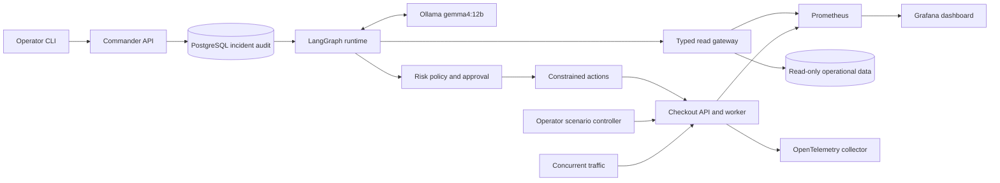

# Agentic Incident Commander

A local incident-response lab built with FastAPI, LangGraph, PostgreSQL, and Ollama **`gemma4:12b`**. The agent investigates real demo-service failures, records evidence, proposes constrained remediation, pauses for risky-action approval, verifies recovery, and writes a Markdown postmortem.

Nothing here is mocked. A checkout service holds real PostgreSQL connections from a pool of four while concurrent traffic runs, so an injected fault degrades measured latency and error rates that Prometheus actually scrapes. The agent diagnoses from those symptoms; scenario ground truth is hidden from every tool it can reach. Authority stays outside the model: risk classification, the approval gate, and the evidence requirements are deterministic code, not model output.

## Architecture



Code lives in `packages/commander/`; entrypoints are listed in [apps/README.md](apps/README.md). Infrastructure is under `infra/`, fixtures under `scenarios/`, migrations under `migrations/`, and tests under `tests/`. Requirements remain in [specs/001-local-incident-commander/](specs/001-local-incident-commander/).

## Quickstart

Install Docker Desktop/Engine, Python 3.12+, uv, and Ollama. Start Docker and Ollama, then run:

```bash
ollama pull gemma4:12b
make bootstrap
make up
```

On Windows without Make:

```powershell
uv sync --frozen --link-mode copy
uv run python -m commander.cli bootstrap
uv run python -m commander.cli up
```

Bootstrap generates credentials in the ignored `.env` file. Compose applies migrations, seeds the database, and starts the services. Containers reach host Ollama at `http://host.docker.internal:11434`; override `OLLAMA_BASE_URL` when needed. No cloud account or paid API is required.

## Reproducible incident flow

```bash
make health
make scenario SCENARIO=checkout-bad-feature-flag
make incident SCENARIO=checkout-bad-feature-flag
# Follow this incident interactively and review its approval prompt:
make demo
make reset
```

For manual inspection instead of the interactive demo, copy the incident UUID and use:

```bash
uv run python -m commander.cli status <incident-id>
uv run python -m commander.cli timeline <incident-id>
uv run python -m commander.cli approve <incident-id> --comment "Reviewed flag rollback"
uv run python -m commander.cli report <incident-id>
make reset
```

Review the proposed plan before approving. Use `reject` to escalate without execution. Restarting the runtime resumes persisted checkpoints and approval waits.

| Scenario | Observable failure | Remediation |
| --- | --- | --- |
| `checkout-db-pool-exhaustion` | Held connections under concurrent load; latency and pool wait rise | Disable `slow_db`, with approval |
| `checkout-bad-feature-flag` | HTTP 500 and `CheckoutPathError` | Disable `new_checkout_path`, with approval |
| `worker-stalled` | Worker stays alive while jobs accumulate | Restart the consumer, low risk |

Keep traffic running during investigation and verification. Metric windows retain old failures; verification can take about three minutes after remediation.

## Observability and safety

- Open [API docs](http://localhost:8000/docs), [Grafana](http://localhost:3000/d/incident-lab), or [Prometheus](http://localhost:9090). Ports bind to localhost.
- Tool attempts, model calls, transitions, approvals, and verification are persisted. Structured PostgreSQL log search is the selected local log backend. OpenTelemetry exports HTTP/DB traces to the collector.
- Authenticated `GET /api/v1/incidents/{id}/remediations` exposes every plan and its outcomes. Reports preserve prior attempts, including pending and rejected actions.
- The model has no shell, Docker socket, arbitrary SQL, or scenario-controller tool. Investigation credentials cannot write, read incident tables, or see the internal stall flag.
- Risk comes from a deterministic registry. Approval is bound to the incident and plan; interrupted actions are not automatically replayed.
- The [diagnosis gate](docs/diagnosis-gate.md) requires cited operational signals before planning remediation. Missing evidence returns to bounded investigation; an unconfirmed cause cannot authorize an action.
- The local Gemma sampler uses a structural JSON schema for compatibility. Complete Pydantic validation still enforces bounds, UUIDs, and all other response constraints.

## Development and evaluation

See [local development](docs/local-development.md) for host/container Ollama,
Windows commands, model readiness checks, and persistent-volume behavior.

An optional [MCP transport](docs/mcp.md) separates read tools and policy-gated
actions into private stdio servers. Set `TOOL_TRANSPORT=mcp` to enable it;
direct typed adapters remain the default.

The same workflow, policy, and contracts also run on a local
[Kubernetes cluster](docs/kubernetes.md) through `commander.kube_cli`, where reads and
actions use separate service-account tokens with namespace-scoped RBAC. Docker Compose
remains the default quickstart.

```bash
make test       # deterministic tests; no Docker/model required
make lint       # Ruff
make typecheck  # strict mypy
make build
make logs
make down       # preserves the database volume
RUN_LIVE_TESTS=1 uv run pytest tests/integration -q
```

In PowerShell, set `$env:RUN_LIVE_TESTS = '1'` before running the integration tests. They inject/reset fixtures; run them when no incident is active.

Real-model evaluations export per-incident audits, postmortems, and JSON/CSV scores:

```bash
uv run python -m commander.evals --trials 10 --approve-fixtures --output artifacts/evals/run-01
```

Fixture autoapproval requires the explicit evaluation flag. Use one evaluation batch at a time because scenarios share the lab. Diagnosis scoring uses a phrase rubric with separate evidence, recovery, and approval checks; inspect saved audits when interpreting results. [Rubric 2.1](docs/evaluation-rubric.md) validates selected citations against observed signals, covers the Kubernetes zero-replica scenario, and exports missing-check details. Every exported result records its `scorer_version`.

Measured 30-run baseline: diagnosis **23/30**, recovery **28/30**, approval policy **30/30**,
but citation-based evidence **4/30**. That baseline predates the fixes below and remains the
only multi-run benchmark; it does not meet the full acceptance criteria.

Three defects were then found by running the lab, fixed, and revalidated with single live
trials: log search ignored structured error names, a correct diagnosis could still propose an
action that cannot affect the failing service, and a rejected diagnosis ended the incident
instead of returning to investigation. After the fixes, one Compose pool trial and one live
Kubernetes trial each passed diagnosis, cited evidence, recovery, and approval policy. Single
trials are not a reliability rate. See [evaluation results](docs/evaluation-results.md) for
every run ID, the preserved failures, and what remains unmeasured.

Every task in [tasks.md](specs/001-local-incident-commander/tasks.md) is implemented except
the optional web UI, and every item in [acceptance.md](specs/001-local-incident-commander/acceptance.md)
is satisfied with linked evidence. See [implementation status](docs/implementation-status.md)
for verified results and open verification. A successful live incident proves an end-to-end
path, not completion of the 30-run benchmark.
